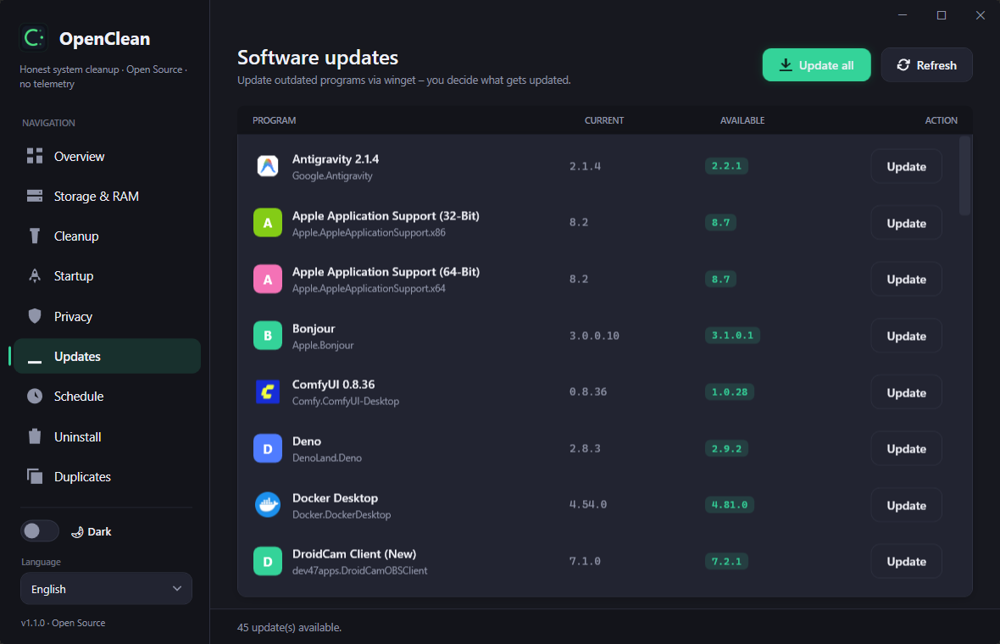
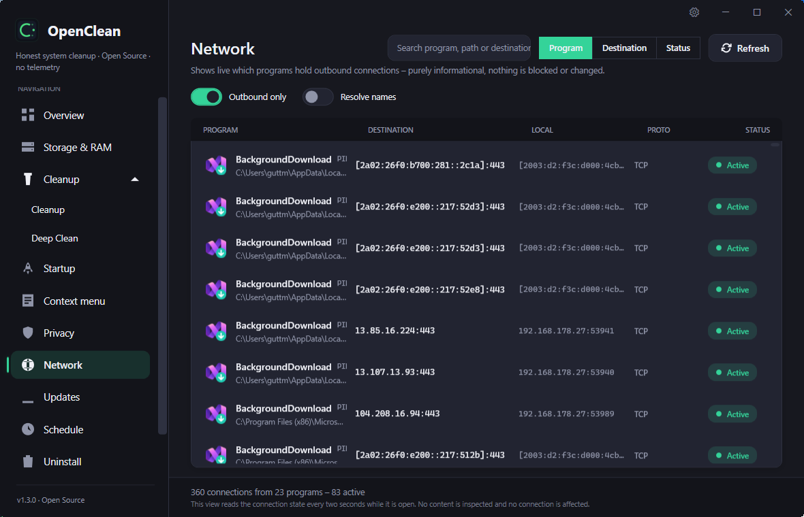
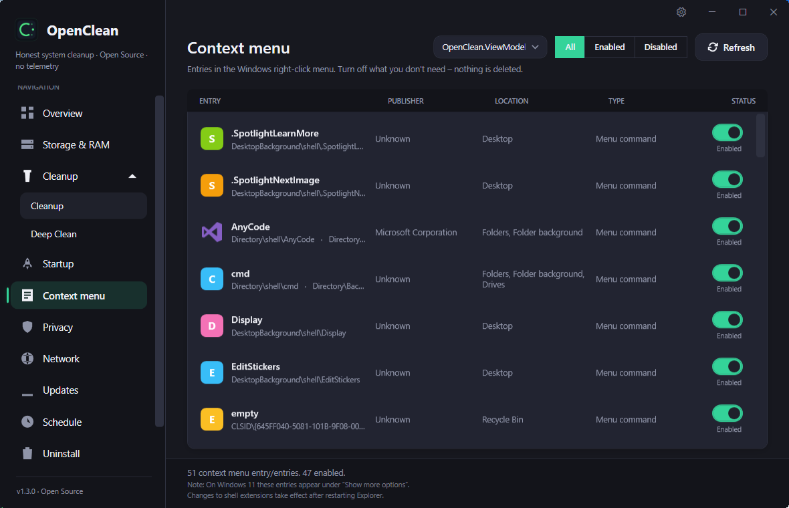
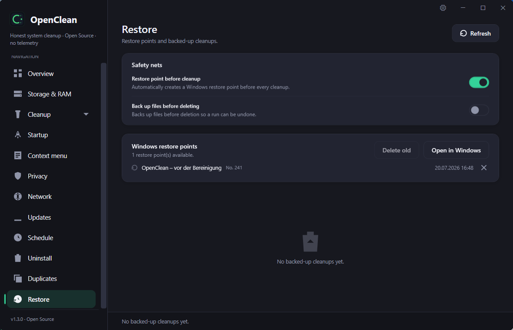
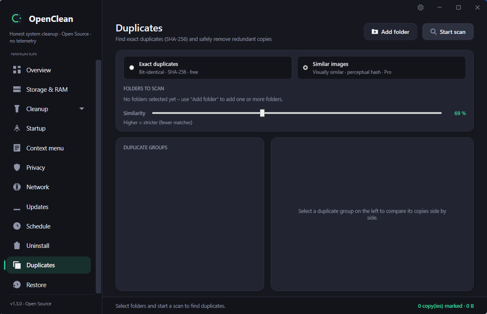
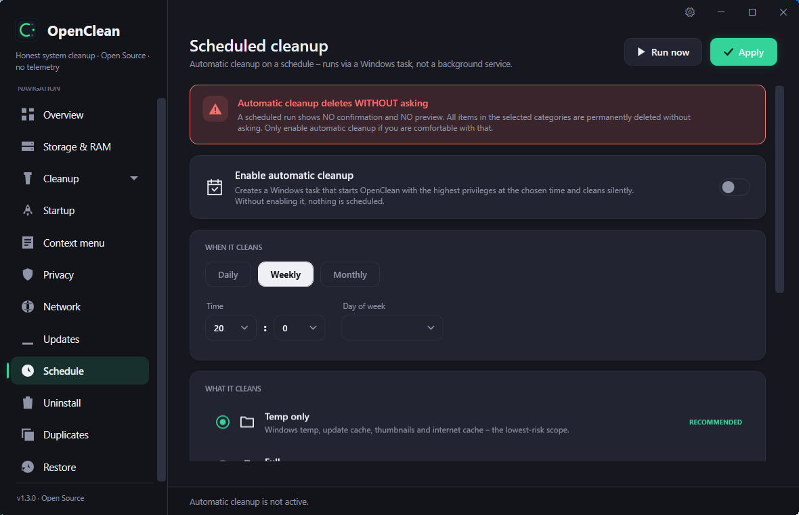
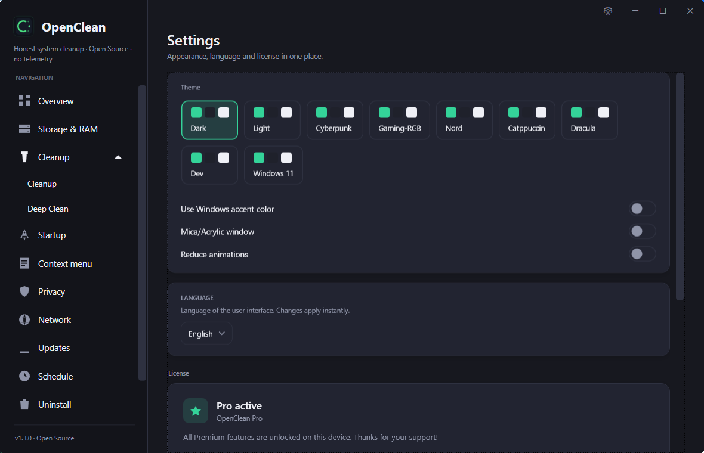

<div align="center">

# OpenClean

**Honest system cleaning for Windows — real measurements, no telemetry, no dark patterns.**

[](https://github.com/daonware-it/OpenClean/releases)
[](https://github.com/daonware-it/OpenClean/releases)
[](#download)
[](https://dotnet.microsoft.com/)
[](#license)

</div>

OpenClean shows you an honest picture of your Windows system and cleans only what you
choose. No fake "speed boosts", no invented problems, no account, no background service,
and **no telemetry**. Every number you see is a real measurement.


## Features

**Free — everything you need for day-to-day maintenance:**

- 🧭 **Overview dashboard** — a real system score with the exact factors behind it (reclaimable space, startup load, drive pressure) and one-click recommendations.
- 💾 **Storage & RAM** — live memory usage and per-drive space, plus a sunburst analysis you can click into to see what actually occupies the drive.
- ❤️ **Drive health** — a verdict for every physical disk (healthy · keep an eye on it · failure likely), read locally from SMART through Windows. No vendor tool, no online lookup, nothing changed. The verdict is free; the individual readings are Premium.
- 🧹 **Cleanup** — preview temp files and caches (Windows, thumbnails, browsers, …) before anything is deleted. **You decide** what gets removed.
- 🧱 **Deep system cleanup** — reclaim space Windows keeps to itself: the previous installation (Windows.old), the component store (WinSxS), shadow copies, the Windows Update cache and the Delivery Optimization cache. Occupied and reclaimable space are shown as two honest numbers, each area confirms separately, and freed space is measured before/after — never estimated.
- ↩️ **Safety net & restore** — optionally create a restore point and back up files before a cleanup, then undo a whole run from the Restore view. Existing Windows restore points are listed there too.
- 📦 **Large files** — track down the biggest space hogs and move them to the Recycle Bin. Files that cannot go to the bin are named before anything is deleted.
- ⭐ **Startup** — see and manage autostart entries and their impact on boot time, or stagger them after sign-in instead of launching everything at once.
- 🌐 **Network transparency (local)** — a live, read-only view of which programs hold connections to the outside: process name and path, remote address and port, and connection state. Sortable and filterable. It never blocks, throttles or inspects a connection, polls only while the view is open, and reverse-DNS lookup stays off by default.
- 🖱️ **Context menu** — switch off entries in the Windows right-click menu (nothing is deleted).
- 🛡️ **Privacy** — find and clear privacy-relevant traces. The cookie inventory lists the actual cookie names per domain (never their values), with a live search box, and can even read cookie databases a running browser holds locked.
- ⬆️ **Updates** — check for new System versions.
- 🗑️ **Uninstall** — list installed programs by size and remove them, including a scan for leftover folders and registry remnants. **Single uninstall is always free.**
- 📑 **Duplicate finder** — find exact duplicates by SHA-256 and safely remove redundant copies.
- 🎨 **Themes & settings** — one settings area (gear icon) for theme, language and license. Several live-switching visual styles beyond light and dark — Cyberpunk, Gaming-RGB, Nord, Catppuccin, Dracula, a Dev editor look and a Windows 11 style — plus optional Windows accent-colour follow, a real Mica/Acrylic backdrop on Windows 11 and a "reduce animations" switch.

**Premium — optional one-time purchase:**

- ⏰ **Scheduled cleaning** — run a chosen cleanup profile automatically on a schedule.
- 🗑️ **Batch uninstall** — remove several programs at once in one pass.
- 📊 **Drive SMART details** — the individual disk readings behind the free health verdict: temperature, life remaining, power-on hours, power cycles, reallocated/pending sectors and total bytes written (TBW), including decoded NVMe values.
- 🖼️ **Similar images** — find visually similar pictures via perceptual hashing, not just byte-identical duplicates.
- 🔥 **Secure delete** — overwrite files before removal instead of only moving them to the Recycle Bin.

Premium unlocks are handled by a signed, device-bound license. See [Privacy](#privacy--offline) below.

## Screenshots

Premium features are marked with ⭐.

| Storage & RAM | Cleanup |
|---|---|
|  |  |

| Uninstall | Software updates |
|---|---|
|  |  |

| Network transparency | Context menu |
|---|---|
|  |  |

| Safety net & restore | Duplicate finder · Similar images ⭐ |
|---|---|
|  |  |

| Scheduled cleaning ⭐ | Themes & settings |
|---|---|
|  |  |

## Download

Grab the latest release from the [**Releases**](https://github.com/daonware-it/OpenClean/releases) page:

- **Installer** (`OpenClean-Setup-x.y.z.exe`) — classic setup, stores its settings in `%AppData%\OpenClean`.
- **Portable** (`OpenClean-Portable-x.y.z.zip`) — a single self-contained executable that keeps its data next to itself. Runs from a USB stick; no installation, no .NET required.

Both are **code-signed** (Azure Trusted Signing, publisher *DaonWare*), so Windows SmartScreen accepts them without warnings. On start OpenClean verifies its own signature and locks the modifying functions if the file was tampered with after signing; builds from source are unsigned and keep working, they only show a hint.

## Privacy & offline

Privacy is a design goal, not a footnote:

- **No telemetry, no account, no background service.**
- A **free** installation makes **no network connections at all**.
- Only when a Premium license is present does OpenClean contact its license server
  (`daonware.de`) — to validate the license on start and renew its token. It transmits
  only the license key, an anonymous device hash, and the app version.
- Premium works **offline for up to 30 days** between successful server checks; after that,
  a single online check is required. A license revoked on the server is detected and
  removed locally on the next start with internet.

Full details: [PRIVACY.md](PRIVACY.md).

## Languages

OpenClean ships with 7 UI languages: German, English, Spanish, French, Polish,
Portuguese, and Russian. The language follows your Windows setting on first start and can
be changed at any time.

## Building from source

Requirements: **Windows 10/11** and the **.NET 10 SDK**.

```bash
git clone https://github.com/daonware-it/OpenClean.git
cd OpenClean
dotnet build OpenClean/OpenClean.csproj -c Debug
```

Run it:

```bash
dotnet run --project OpenClean/OpenClean.csproj
```

Build the self-contained portable single-file executable:

```bash
dotnet publish OpenClean/OpenClean.csproj -p:PublishProfile=Portable -o publish/portable
```

> OpenClean is a WPF app targeting `net10.0-windows` and therefore builds and runs on
> Windows only.

## License

OpenClean follows an **open-core** model: the application in this repository is open
source, while the optional **Premium module** (scheduled cleaning, batch uninstall, drive
SMART details, similar-image search, secure delete) is a separate, proprietary component
delivered after license activation. OpenClean never
deletes programs itself — it always invokes the vendor's own uninstaller, the only correct
way to remove software.

---

<div align="center">
Made with an allergy to bloatware. · <a href="https://daonware.de/openclean/premium">Get Premium</a>
</div>
