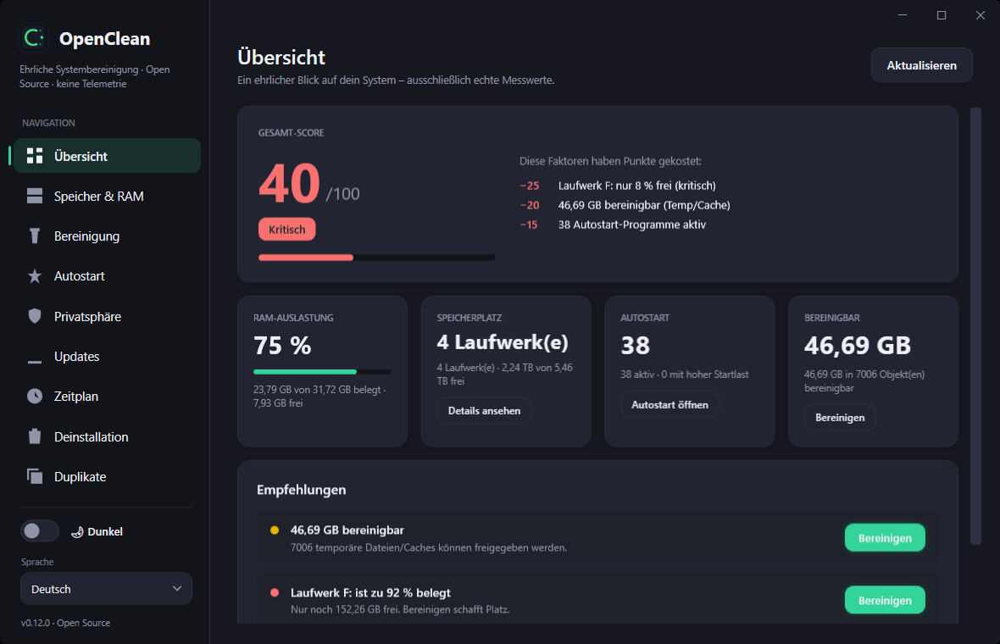
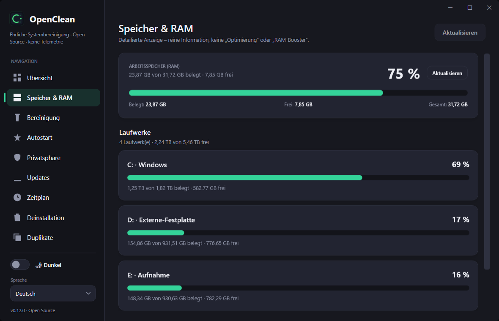
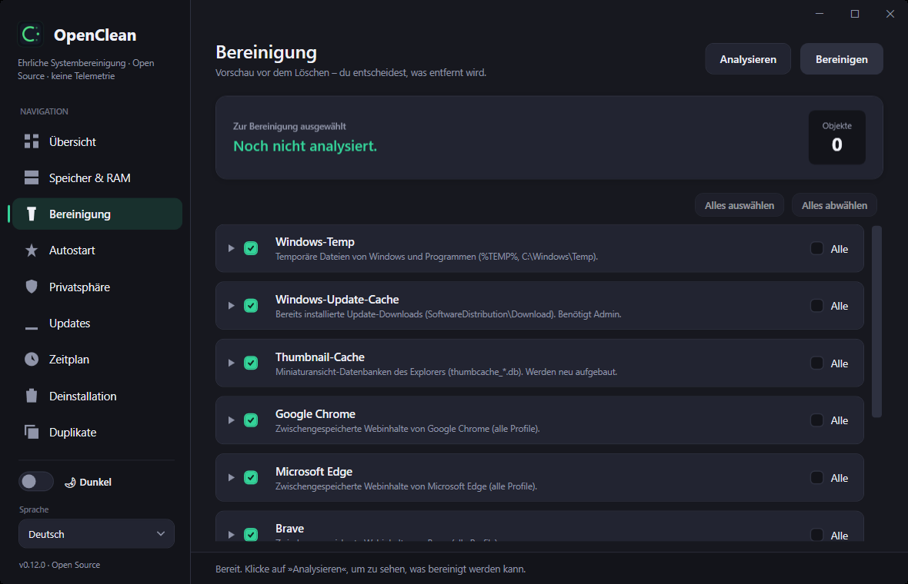
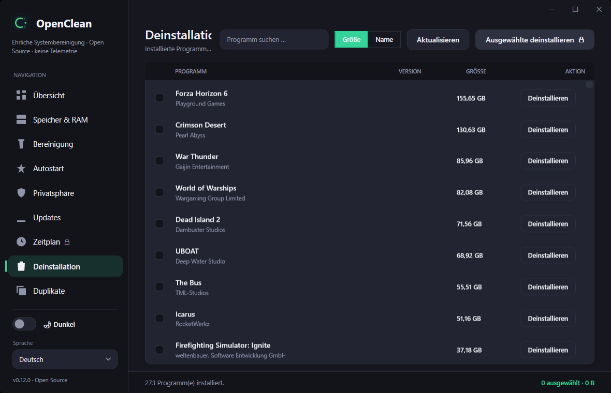
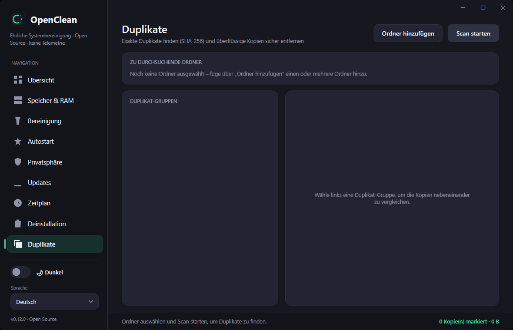

<div align="center">

# OpenClean

**Honest system cleaning for Windows — real measurements, no telemetry, no dark patterns.**

[](https://github.com/daonware-it/OpenClean/releases)
[](#download)
[](https://dotnet.microsoft.com/)
[](#license)

</div>

OpenClean shows you an honest picture of your Windows system and cleans only what you
choose. No fake "speed boosts", no invented problems, no account, no background service,
and **no telemetry**. Every number you see is a real measurement.



## Features

**Free — everything you need for day-to-day maintenance:**

- 🧭 **Overview dashboard** — a real system score with the exact factors behind it (reclaimable space, startup load, drive pressure) and one-click recommendations.
- 💾 **Storage & RAM** — live memory usage and per-drive space, purely informational (no gimmicks).
- 🧹 **Cleanup** — preview temp files and caches (Windows, thumbnails, browsers, …) before anything is deleted. **You decide** what gets removed.
- ⭐ **Startup** — see and manage autostart entries and their impact on boot time.
- 🛡️ **Privacy** — find and clear privacy-relevant traces.
- ⬆️ **Updates** — check for new OpenClean versions.
- 🗑️ **Uninstall** — list installed programs by size and remove them, including a scan for leftover folders and registry remnants. **Single uninstall is always free.**
- 📑 **Duplicate finder** — find exact duplicates by SHA-256 and safely remove redundant copies.

**Premium — optional one-time purchase:**

- ⏰ **Scheduled cleaning** — run a chosen cleanup profile automatically on a schedule.
- 🗑️ **Batch uninstall** — remove several programs at once in one pass.

Premium unlocks are handled by a signed, device-bound license. See [Privacy](#privacy--offline) below.

## Screenshots

| Storage & RAM | Cleanup |
|---|---|
|  |  |

| Uninstall | Duplicate finder |
|---|---|
|  |  |

## Download

Grab the latest release from the [**Releases**](https://github.com/daonware-it/OpenClean/releases) page:

- **Installer** (`OpenClean-Setup-x.y.z.exe`) — classic setup, stores its settings in `%AppData%\OpenClean`.
- **Portable** (`OpenClean-Portable-x.y.z.zip`) — a single self-contained executable that keeps its data next to itself. Runs from a USB stick; no installation, no .NET required.

Both are **code-signed** (Azure Trusted Signing, publisher *DaonWare*), so Windows SmartScreen accepts them without warnings.

## Privacy & offline

Privacy is a design goal, not a footnote:

- **No telemetry, no account, no background service.**
- A **free** installation makes **no network connections at all**.
- Only when a Premium license is present does OpenClean contact its license server
  (`daonware.de`) — to validate the license on start and renew its token. It transmits
  only the license key, an anonymous device hash, and the app version.
- Premium works **offline for up to 30 days** between successful server checks; after that,
  a single online check is required. A license revoked on the server is detected and
  removed locally on the next start with internet.

Full details: [PRIVACY.md](PRIVACY.md).

## Languages

OpenClean ships with 7 UI languages: German, English, Spanish, French, Polish,
Portuguese, and Russian. The language follows your Windows setting on first start and can
be changed at any time.

## Building from source

Requirements: **Windows 10/11** and the **.NET 10 SDK**.

```bash
git clone https://github.com/daonware-it/OpenClean.git
cd OpenClean
dotnet build OpenClean/OpenClean.csproj -c Debug
```

Run it:

```bash
dotnet run --project OpenClean/OpenClean.csproj
```

Build the self-contained portable single-file executable:

```bash
dotnet publish OpenClean/OpenClean.csproj -p:PublishProfile=Portable -o publish/portable
```

> OpenClean is a WPF app targeting `net10.0-windows` and therefore builds and runs on
> Windows only.

## License

OpenClean follows an **open-core** model: the application in this repository is open
source, while the optional **Premium module** (scheduled cleaning, batch uninstall) is a
separate, proprietary component delivered after license activation. OpenClean never
deletes programs itself — it always invokes the vendor's own uninstaller, the only correct
way to remove software.

---

<div align="center">
Made with an allergy to bloatware. · <a href="https://daonware.de/openclean/premium">Get Premium</a>
</div>
